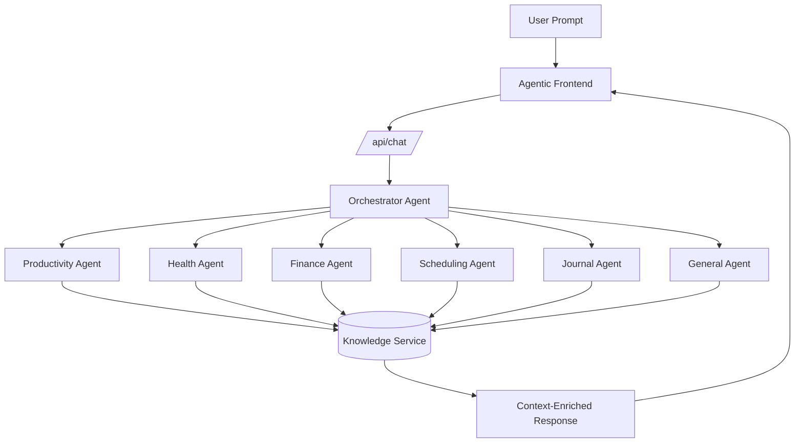
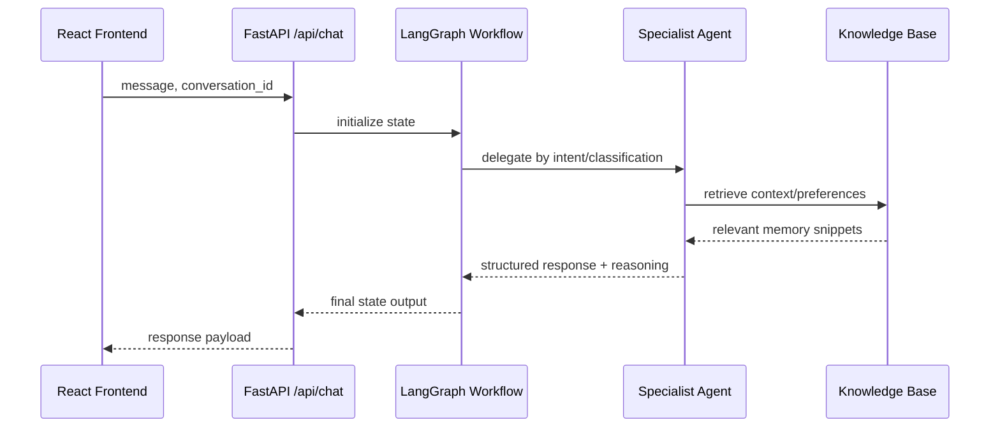
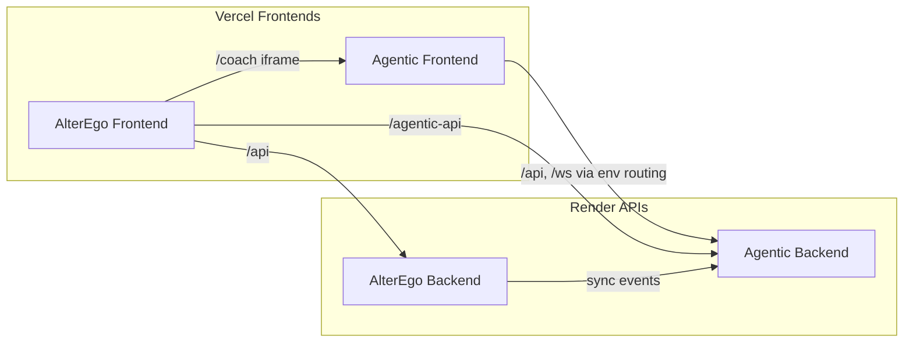

# Agentic Lyf: Multi-Agent AI Assistant System

Agentic Lyf is a personal AI operating layer built with specialist agents, orchestration workflows, knowledge retrieval, and configurable LLM providers.

The goal is to deliver practical, context-aware assistance across productivity, health, finance, scheduling, and journaling while remaining deployable in real-world cloud environments.

## Why This Repository Stands Out

- Multi-agent architecture with an orchestrator and domain-specific specialists.
- RAG-style knowledge services for preferences, onboarding context, and retrieval-driven responses.
- Provider flexibility: OpenAI and Ollama with runtime switching.
- Production integration with AlterEgo frontend through coach embedding and API bridge routing.

## Core Capabilities

### Orchestrated assistant experience
- Central orchestrator routes requests to specialist agents.
- Domain agents for productivity, health, finance, scheduling, and journaling.
- Unified chat endpoint with structured reasoning payloads.

### Knowledge and personalization
- Knowledge APIs for entries, preferences, onboarding profile, and embeddings.
- Persistent local knowledge artifacts under `data/`.
- Preference-aware response behavior across sessions.

### Reliability and ops readiness
- `/health` and `/api/health` endpoints for service checks.
- Configurable CORS for local and hosted frontends.
- Cloud-friendly frontend API routing rewrite layer.

## Architecture

### Agent orchestration map



### Request lifecycle



### Cross-app deployment bridge (AlterEgo + Agentic)



## Technology Stack

| Layer | Technologies |
|---|---|
| Frontend | React 18, TypeScript, Vite, Tailwind CSS, Framer Motion |
| Backend | FastAPI, Pydantic, Uvicorn |
| Agent runtime | LangChain, LangGraph |
| LLM providers | OpenAI, Ollama |
| Retrieval/data | FAISS, local knowledge storage |
| Testing | pytest, Vitest |

## Repository Structure

```text
Agentic_lyf/
├── backend/
│   ├── app/agents/                # specialist and orchestrator agents
│   ├── app/api/                   # knowledge and approval APIs
│   ├── app/services/              # knowledge base and service layer
│   └── main.py                    # FastAPI app entrypoint
├── frontend/
│   ├── src/components/            # chat, onboarding, knowledge UI
│   ├── src/lib/installApiRouting.ts
│   └── vite.config.ts
├── data/                          # vector indexes and runtime data files
└── README.md
```

## Local Development

### Prerequisites
- Python 3.11+
- Node.js 18+
- npm

### 1) Backend setup

```bash
cd backend
python -m venv .venv
source .venv/bin/activate
pip install -r requirements.txt
uvicorn main:app --reload --host 0.0.0.0 --port 8000
```

Backend default: `http://localhost:8000`

### 2) Frontend setup

```bash
cd frontend
npm install
npm run dev
```

Frontend default: `http://localhost:3000`

## Configuration

### Root environment (`.env.example`)

Key variables:
- `LLM_PROVIDER`
- `OPENAI_API_KEY`
- `OLLAMA_ENDPOINT`
- `OLLAMA_MODEL`
- `LANGSMITH_API_KEY` (optional)
- `TELEGRAM_BOT_TOKEN` (optional)

### Frontend environment (`frontend/.env.example`)

- `VITE_AGENTIC_API_ORIGIN`
- `VITE_AGENTIC_WS_ORIGIN`
- `VITE_BASE_PATH`
- `VITE_AGENTIC_API_PREFIX`

## API Surface

- `GET /health`
- `GET /api/health`
- `POST /api/chat`
- `GET /api/agents/status`
- `GET/POST/PUT/DELETE /api/knowledge/...`
- `POST /api/llm/switch-provider`

## Production Notes

- Agentic backend is API-first and is expected to run behind Render.
- Agentic frontend is expected to run on Vercel and route API calls through environment-driven rewrites.
- For AlterEgo embedding scenarios, set the coach iframe source to Agentic frontend URL (not backend API URL).

## Engineering Highlights For Hiring Managers

- Designed and shipped a multi-agent orchestration surface with practical API contracts.
- Integrated RAG-style knowledge workflows into product UX, not just backend demos.
- Solved deployment edge cases across CORS, environment-driven routing, and split frontend/backend hosting.
- Kept architecture extensible for upcoming Telegram and mobile surfaces.
