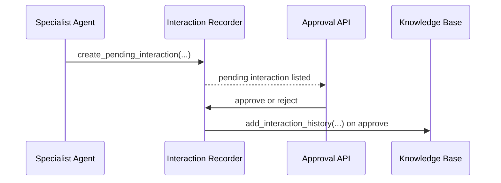

# Agentic Lyf

Agentic Lyf is a multi-agent AI layer with persistent knowledge, approval-based memory capture, and cross-app ingestion from AlterEgo Time Tracking.

It is designed for practical, context-aware assistance across productivity, health, finance, scheduling, and journaling.

## Current Platform Scope

### Multi-agent orchestration
- Enhanced orchestrator with specialist delegation.
- Domain specialists: health, productivity, finance, scheduling, journal.
- Structured reasoning payload returned with chat responses.

### Knowledge and personalization
- User-scoped FAISS vector storage and knowledge entries.
- Onboarding profile, goals, planner preferences, interaction history.
- Embeddings visualization and analytics endpoints.

### Approval-first interaction memory
- Specialist responses are staged as pending interactions.
- User approval endpoints decide whether staged interactions persist into the knowledge base.
- Supports safer personalization and prevents low-value memory pollution.

### Force refresh and cache coherence
- Dedicated knowledge refresh endpoint to rebuild user-scoped in-memory services from persisted index files.
- Frontend refresh uses cache-busting and no-store fetches for entries, preferences, stats, and onboarding profile.

### AlterEgo bridge
- Ingests onboarding snapshots.
- Ingests time-entry interaction events (including backfill pathways).
- Ingests habit snapshot events.

## Architecture

### High-level flow

```mermaid
flowchart TD
  U[User] --> FE[Agentic Frontend]
  FE --> API[/api/chat]
  API --> ORCH[Enhanced Orchestrator]
  ORCH --> PROD[Productivity Agent]
  ORCH --> HEAL[Health Agent]
  ORCH --> FIN[Finance Agent]
  ORCH --> SCHED[Scheduling Agent]
  ORCH --> JOUR[Journal Agent]

  PROD --> KB[(Knowledge Base Service)]
  HEAL --> KB
  FIN --> KB
  SCHED --> KB
  JOUR --> KB

  KB --> API
  API --> FE
```

### Knowledge lifecycle



## Repository Layout

```text
Agentic_lyf/
├── backend/
│   ├── app/agents/                # orchestrator and specialist agents
│   ├── app/api/                   # chat, knowledge, approval APIs
│   ├── app/services/              # knowledge, recorder, vector store
│   └── main.py                    # FastAPI entrypoint
├── frontend/
│   ├── src/components/            # chat and knowledge management UIs
│   └── src/lib/                   # routing and runtime helpers
├── data/                          # persisted vector/index artifacts
└── README.md
```

## Local Development

### Prerequisites
- Python 3.11+
- Node.js 18+
- npm

### Backend

```bash
cd backend
python -m venv .venv
source .venv/bin/activate
pip install -r requirements.txt
uvicorn main:app --reload --host 0.0.0.0 --port 8000
```

### Frontend

```bash
cd frontend
npm install
npm run dev
```

Defaults:
- Backend: http://localhost:8000
- Frontend: http://localhost:3000

## Key Environment Variables

### Backend
- LLM_PROVIDER
- OPENAI_API_KEY
- OLLAMA_ENDPOINT
- OLLAMA_MODEL
- JWT_SECRET
- AGENTIC_BRIDGE_SECRET

### Frontend
- VITE_AGENTIC_API_ORIGIN
- VITE_AGENTIC_WS_ORIGIN
- VITE_AGENTIC_API_PREFIX
- VITE_BASE_PATH

## API Summary

### Health and chat
- GET /health
- GET /api/health
- POST /api/chat

### Knowledge
- GET, POST, PUT, DELETE /api/knowledge/entries
- GET /api/knowledge/stats
- GET /api/knowledge/preferences
- GET /api/knowledge/onboarding/profile
- POST /api/knowledge/interactions
- POST /api/knowledge/refresh

### Approval workflow
- GET /api/approval/pending
- POST /api/approval/approve
- GET /api/approval/stats
- POST /api/approval/bulk-approve

## Operational Notes

- Knowledge storage is user-scoped using request context identity.
- Pending approvals are held in memory; approve promptly when running non-persistent local environments.
- Use /api/knowledge/refresh when you suspect stale in-memory state after external sync events.

## Integration Notes (AlterEgo)

- Onboarding snapshots are ingested via /api/knowledge/onboarding.
- Time and habit events are ingested via /api/knowledge/interactions.
- Sync payload context fields drive category inference and deduplication behavior in the knowledge layer.
